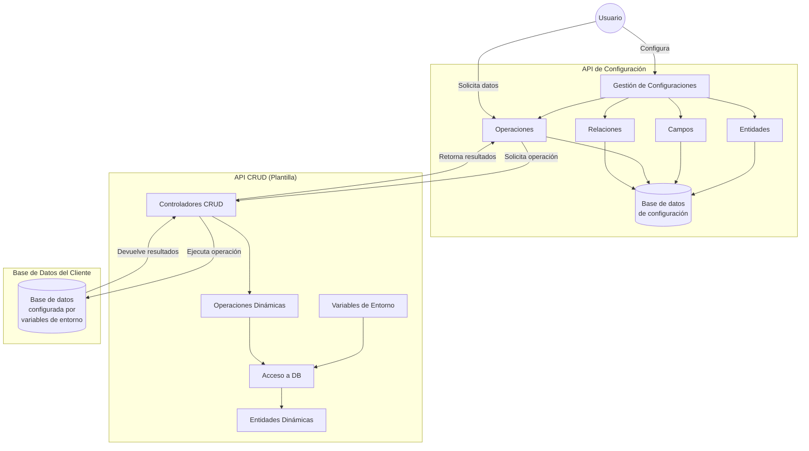
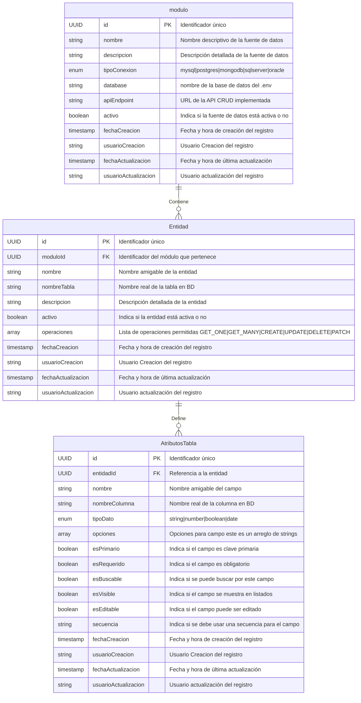
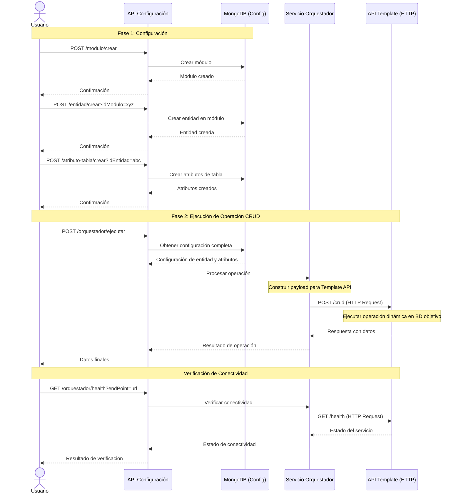

# API de Configuración Paramétrica

<div>
    
</div>

**Autor:** Equipo de Desarrollo Porvenir

[](https://opensource.org/licenses/Apache-2.0)
[](https://nodejs.org/)
[](https://nestjs.com/)
[](https://www.typescriptlang.org/)
[](https://www.npmjs.com/)
[](https://www.mongodb.com/)

## **Introducción**

La API de Configuración Paramétrica es el componente central del Sistema CRUD Configurable que permite gestionar la configuración de entidades, campos, operaciones y relaciones. Esta API facilita la definición de módulos que representan diferentes fuentes de datos y sus respectivas entidades con sus atributos, permitiendo la ejecución dinámica de operaciones CRUD.

### **Información del Servicio**

- **Nombre del servicio:** `pendig-ms-configuracion-parametria-nodejs`
- **Puerto por defecto:** 3100
- **Base de datos:** MongoDB

### **Descripción**

- **Funcionalidad Principal:** Gestión de configuraciones paramétricas para operaciones CRUD dinámicas
- **Conexión Base de datos:** MongoDB (almacena todas las configuraciones)

### **Especificaciones Técnicas**

#### **Tecnología a Utilizar**

- **Lenguaje de Programación:** Node.js 22.12.0 - TypeScript 5.7.3
- **Framework:** NestJS 11.0.1
- **Base de Datos:** MongoDB 8.7.1
- **Contenedores:** Docker
- **Orquestador de Contenedores:** Kubernetes (AKS - Azure Kubernetes Service)

## **Arquitectura del Sistema**

### **1. Diagrama de Arquitectura General**



### **2. Modelo de Datos - Configuración Paramétrica**



### **3. Diagrama de Secuencia - Flujo de Configuración y Orquestación**



## **Endpoints Principales**

### **Gestión de Módulos**

#### **Crear Módulo**

```http
POST /service/pendig/transversales/conf-parametria/api/v1/modulo/crear
```

**Body:**

```json
{
  "data": {
    "nombre": "Sistema de Usuarios",
    "descripcion": "Módulo para gestión de usuarios",
    "tipoConexion": "oracle",
    "database": "ORACLE_MAIN",
    "apiEndpoint": "http://localhost:3001/api/v1",
    "usuarioCreacion": "admin"
  }
}
```

#### **Listar Módulos**

```http
POST /service/pendig/transversales/conf-parametria/api/v1/modulo/listar
```

**Body:**

```json
{
  "filtros": {
    "nombre": "Sistema",
    "activo": "true"
  },
  "paginacion": {
    "pagina": 1,
    "size": 10
  },
  "sorting": {
    "fechaCreacion": "DESC"
  }
}
```

### **Gestión de Entidades**

#### **Crear Entidad**

```http
POST /service/pendig/transversales/conf-parametria/api/v1/entidad/crear?idModulo={id}
```

**Body:**

```json
{
  "data": {
    "nombre": "Usuario",
    "nombreTabla": "USUARIOS",
    "descripcion": "Tabla de usuarios del sistema",
    "operaciones": ["GET_ONE", "GET_MANY", "CREATE", "UPDATE", "DELETE"],
    "usuarioCreacion": "admin"
  }
}
```

### **Gestión de Atributos**

#### **Crear Atributo de Tabla**

```http
POST /service/pendig/transversales/conf-parametria/api/v1/atributo-tabla/crear?idEntidad={id}
```

**Body:**

```json
{
  "data": {
    "nombre": "ID Usuario",
    "nombreColumna": "ID_USUARIO",
    "tipoDato": "number",
    "esPrimario": true,
    "esRequerido": true,
    "esVisible": true,
    "esEditable": false,
    "secuencia": "SEQ_USUARIO",
    "usuarioCreacion": "admin"
  }
}
```

### **Orquestador de Operaciones**

#### **Ejecutar Operación CRUD**

```http
POST /service/pendig/transversales/conf-parametria/api/v1/orquestador/ejecutar
```

**Body:**

```json
{
  "type": "GET_MANY",
  "endpoint": "http://localhost:3001/api/v1",
  "entityDefinition": {
    "name": "usuarios",
    "tableName": "USUARIOS",
    "connectionId": "oracle_main",
    "fields": [
      {
        "name": "ID",
        "columnName": "ID_USUARIO",
        "type": "number",
        "isPrimary": true,
        "isVisible": true
      },
      {
        "name": "Nombre",
        "columnName": "NOMBRE",
        "type": "string",
        "isVisible": true,
        "isSearchable": true
      }
    ]
  },
  "filters": {
    "NOMBRE": "Juan"
  },
  "pagination": {
    "page": 1,
    "limit": 10
  }
}
```

#### **Verificar Conectividad con Template**

```http
GET /service/pendig/transversales/conf-parametria/api/v1/orquestador/health?endPoint=http://localhost:3001/api/v1
```

### **Configuración Completa**

#### **Obtener Configuración de Entidad**

```http
GET /service/pendig/transversales/conf-parametria/api/v1/configuracion/obtener?idEntidad={id}
```

## **Enumeraciones del Sistema**

### **Tipos de Conexión**

- `mysql`
- `postgres`
- `mongodb`
- `sqlserver`
- `oracle`

### **Tipos de Datos**

- `string`
- `number`
- `boolean`
- `date`

### **Tipos de Operación**

- `GET_ONE`
- `GET_MANY`
- `CREATE`
- `UPDATE`
- `DELETE`
- `PATCH`
- `GET_COLUMNS`

## **Estructura de Archivos**

```
src/
├── app.module.ts
├── main.ts
├── config/
│   ├── config.module.ts
│   ├── mongodb.config.ts
│   └── env.validation.ts
├── modules/
│   ├── modulo/
│   │   ├── controllers/
│   │   ├── services/
│   │   ├── schemas/
│   │   └── dto/
│   ├── entidad/
│   │   ├── controllers/
│   │   ├── services/
│   │   ├── schemas/
│   │   └── dto/
│   ├── atributos-tabla/
│   │   ├── controllers/
│   │   ├── services/
│   │   ├── schemas/
│   │   └── dto/
│   ├── configuracion/
│   │   ├── controllers/
│   │   └── services/
│   ├── orquestador/
│   │   ├── controllers/
│   │   ├── services/
│   │   └── dto/
│   └── enums/
├── common/
│   ├── dto/
│   ├── enums/
│   └── interceptors/
└── core/
    └── global-exception.filter.ts
```

## **Variables de Entorno**

```bash
# Configuración de la aplicación
PORT=3100
NODE_ENV=development

# MongoDB
MONGODB_URI=mongodb://localhost:27017/config-api

# API Template CRUD
API_CRUD_URL=http://localhost:3001/api/v1
```

## **Comandos Útiles**

### **Desarrollo**

```bash
npm run start:dev
```

### **Compilar**

```bash
npm run build
```

### **Producción**

```bash
npm run start:prod
```

### **Tests**

```bash
npm run test
npm run test:e2e
```

## **Instalación y Configuración**

1. **Clonar el repositorio**
2. **Instalar dependencias:**

   ```bash
   npm install
   ```

3. **Configurar variables de entorno:**

   ```bash
   cp .env.example .env
   # Editar .env con tus configuraciones
   ```

4. **Iniciar MongoDB**
5. **Iniciar la aplicación:**

   ```bash
   npm run start:dev
   ```

La aplicación estará disponible en:

- **API:** `http://localhost:3100/service/pendig/transversales/conf-parametria/api/v1/`
- **Swagger:** `http://localhost:3100/service/pendig/transversales/conf-parametria/api/v1/swagger-ui/index.html`

## **Características Principales**

✅ **Gestión de Módulos**: Define fuentes de datos y sus configuraciones  
✅ **Configuración de Entidades**: Mapea tablas y sus operaciones permitidas  
✅ **Gestión de Atributos**: Define campos, tipos de datos y validaciones  
✅ **Orquestador**: Comunica con APIs template para ejecutar operaciones  
✅ **Validaciones**: Validación automática de datos y configuraciones  
✅ **Paginación**: Soporte nativo para listados paginados  
✅ **Filtros**: Sistema de filtrado flexible  
✅ **Logging**: Trazabilidad completa de operaciones  
✅ **API RESTful**: Endpoints bien estructurados y documentados
