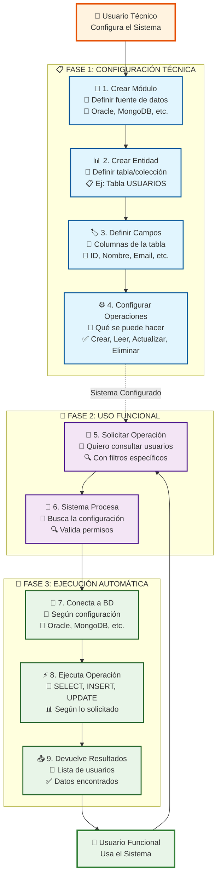
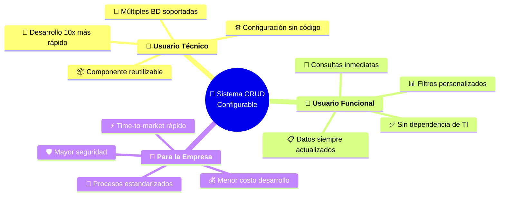
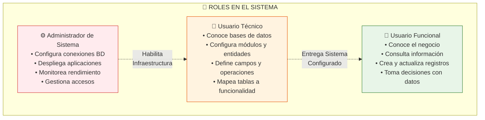

# Diagrama de Flujo Funcional - Sistema CRUD Configurable

## Flujo Completo del Sistema (Vista Funcional)



## Ejemplo Práctico: "Consultar Lista de Empleados"

```mermaid
flowchart TD
    subgraph "🔧 USUARIO TÉCNICO - Configuración Inicial (Una sola vez)"
        direction TB
        Config1[🏢 1. Crear Módulo 'RRHH'<br/>Base de datos: Oracle]
        Config2[📊 2. Crear Entidad 'Empleados'<br/>Tabla: EMPLEADOS]
        Config3[🏷️ 3. Definir Campos:<br/>• ID (número, clave)<br/>• Nombre (texto)<br/>• Cargo (texto)<br/>• Salario (número)]
        Config4[⚙️ 4. Operaciones permitidas:<br/>✅ Consultar<br/>✅ Crear<br/>❌ Eliminar]
        
        Config1 --> Config2 --> Config3 --> Config4
    end
    
    subgraph "👤 USUARIO FUNCIONAL - Uso Diario"
        direction TB
        Uso1[🔍 5. 'Quiero ver empleados<br/>del área de Ventas']
        Uso2[📊 6. Sistema obtiene lista<br/>filtrada por área]
        Result1[📋 7. Lista de empleados:<br/>• Juan Pérez - Vendedor<br/>• María García - Gerente<br/>• Carlos López - Vendedor]
        
        Uso1 --> Uso2 --> Result1
    end
    
    Config4 -.->|Sistema Configurado<br/>Listo para Usar| Uso1
    
    classDef config fill:#fff3e0,stroke:#e65100,stroke-width:2px
    classDef uso fill:#e8f5e8,stroke:#2e7d32,stroke-width:2px
    
    class Config1,Config2,Config3,Config4 config
    class Uso1,Uso2,Result1 uso
```

## Beneficios del Sistema por Usuario



## Roles y Responsabilidades



---

## Resumen Ejecutivo

**¿Qué hace el sistema?**
Permite a los **usuarios técnicos** configurar operaciones de base de datos sin programar, para que los **usuarios funcionales** puedan consultar y gestionar datos inmediatamente.

**¿Cómo funciona?**

1. **🔧 Usuario Técnico configura una vez** qué tablas, campos y operaciones están disponibles
2. **🚀 Sistema genera automáticamente** las interfaces y funcionalidades
3. **👤 Usuario Funcional usa diariamente** para consultar, crear y actualizar datos

**¿Qué beneficios tiene?**

- ⚡ **Desarrollo 10x más rápido** que programación tradicional
- 🎯 **Autonomía funcional** - No depender de TI para consultas básicas
- 🔄 **Reutilizable** para múltiples proyectos y equipos
- 🛡️ **Más seguro** porque usa componentes probados y estandarizados
- 💰 **Menor costo** de desarrollo y mantenimiento a largo plazo

**División clara de responsabilidades:**

- **Usuario Técnico**: "Cómo se conecta y qué se puede hacer"
- **Usuario Funcional**: "Qué datos necesito y cuándo los necesito"
